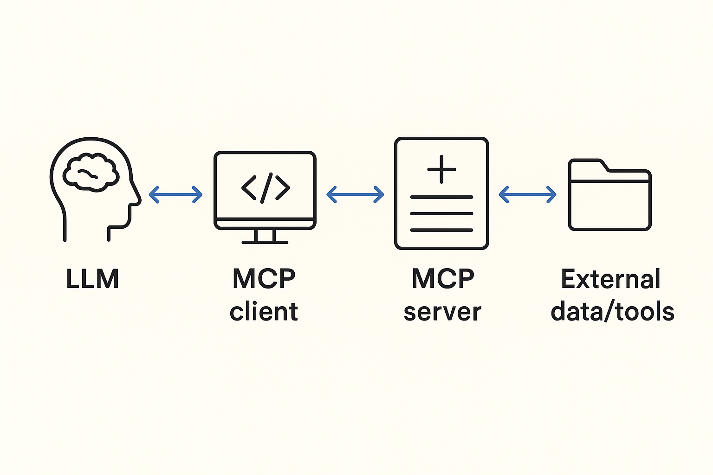

## MCP是什麼？ (What is MCP?)

### 簡單來說 (In Simple Terms)

MCP (Model Context Protocol) 是一種讓 AI 可以像數位助手一樣，與各種應用程式和服務連接的方法。想像一下，AI 不僅能回答你的問題，還能幫你檢查日曆、訂機票、甚至控制智能家居設備。MCP 就是讓 AI 做到這些事情的關鍵技術。

### 專有名詞說明 (Key Terms)

*   **User Prompt:** 你給 AI 的指令或問題，例如 "今天台北天氣如何？"
*   **System Prompt:** AI 的設定，告訴它應該扮演什麼角色，例如 "你是一位專業的學術助手"。
*   **AI Agent:** 一個可以自主執行任務的人工智能系統，例如一個客服機器人。

### MCP 的工作方式 (How MCP Works)

MCP 就像一個通用的連接埠，讓 AI 可以輕鬆地與各種應用程式互動。當你問 AI 一個需要連接外部服務的問題時，AI 會發送一個請求到 MCP 伺服器。MCP 伺服器負責將這個請求轉換成特定應用程式可以理解的指令，然後將結果回傳給 AI。

### MCP 與 Function Call 的區別 (Difference Between MCP and Function Call)

*   **Function Call:** 就像廚師只能使用廚房裡預先準備好的幾把刀。AI 可以調用開發者定義的特定功能，例如查詢天氣或計算數字。
*   **MCP:** 就像一個智能廚房，廚師可以隨時從工具櫃 (MCP 伺服器) 拿取任何合適的工具。AI 可以動態地連接到各種應用程式和服務，甚至可以學習如何使用新的工具。

### MCP 的優勢 (Advantages of MCP)

*   **靈活性:** AI 可以連接到各種不同的應用程式和服務。
*   **易於使用:** 開發者可以更容易地將 AI 與外部系統整合。
*   **更強大的功能:** AI 可以執行更複雜的任務，例如預訂機票和控制智能家居設備。

### 總結 (Conclusion)

MCP 是一種讓 AI 變得更強大和更有用的技術。它讓 AI 可以像一個真正的數位助手一樣，幫助你完成各種任務。

[說明影片](https://youtu.be/1UQ8uz4kuIc?si=emdXD4P_BB-_X_hb)
